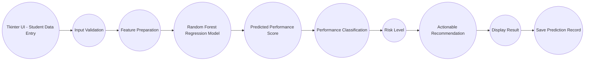

# Smart_Student_Performance_Prediction_System

#### 1. Problem Statement:
- Student performance is influenced by multiple academic and behavioral factors.
- Faculty may find it difficult to identify students who are at risk at an early stage.
- A data-driven system can help predict student performance.
- The system can provide recommendations for improving student outcomes.
- Manual assessment of multiple academic indicators can be time-consuming.

#### 2. Proposed Solution:
- Collect student-related academic information.
- Validate the entered data.
- Process the input features required by the Machine Learning model.
- Use a Random Forest Regression model to predict performance score.
- Classify students based on the predicted score.
- Determine the student's risk level.
- Generate actionable recommendations using academic indicators.
- Display the results through a user-friendly Tkinter interface.
- Support batch prediction using CSV files.
- Store prediction results in a CSV file.

#### 3. Process Flow:
<p align="center"> Start <br> &darr; <br> Enter Student Details <br> &darr; <br> Validate Input <br> &darr; <br> Prepare Input Features <br> &darr; <br> ML Prediction <br> &darr; <br> Determine Performance Level <br> &darr; <br> Determine Risk Level <br> &darr; <br> Generate Actionable Recommendation <br> &darr; <br> Display Result <br> &darr; <br> Save Prediction Record <br> &darr; <br> End</p>

#### 4. Project Mapping:
| V-Model Stage           | Smart Student Project                                      |
|:------------------------|:-----------------------------------------------------------|
| Requirement Analysis    | Identify student performance prediction requirements       |
| System Design           | Design ML workflow, application architecture and GUI       |
| Implementation          | Develop Python + ML + Tkinter application                  |
| Integration             | Integrate GUI, trained model and recommendation logic      |
| Testing                 | Test input validation, prediction and batch processing     |
| Validation              | Evaluate model using R², RMSE, MAE and cross-validation    |
| Demonstration           | Present working student performance prediction application |

### 5. Requirement Analysis
#### 5.1 Functional Requirements
The system should:
+ Accept student details.
+ Accept academic performance indicators.
+ Validate user inputs.
+ Validate percentage and study-hour ranges.
+ Process input data.
+ Load the trained ML model.
+ Predict student performance score.
+ Classify students based on predicted score.
+ Determine student risk level.
+ Generate actionable recommendations.
+ Display results through the GUI.
+ Handle invalid inputs.
+ Provide a clear/reset option.
+ Provide an exit option.
+ Support batch CSV prediction.
+ Store prediction results.

#### 5.2 Non Functional Requirements:
The application should be:
+ User-friendly
+ Easy to understand
+ Fast in generating predictions
+ Reliable
+ Maintainable
+ Scalable
+ Robust against invalid inputs
+ Secure with respect to student data
+ Easy to test
+ Suitable for academic demonstration

#### 5.3 Identify the Users
Primary Users may include:
  + Faculty
  + Academic coordinators
  + Mentors
  + Students

#### 5.4 User Requirements
The user should be able to:
+ Enter student information.
+ Submit the information for analysis.
+ View the predicted performance score.
+ Understand the student's performance classification.
+ Understand the student's risk level.
+ Receive actionable improvement recommendations.
+ Clear the entered information.
+ Process multiple student records using a CSV file.

#### 5.5 Identify System Inputs
The system uses:
+ Student ID
+ Full Name
+ Attendance Rate (%)
+ Daily Study Hours
+ Internal Assessment (%)
+ Assignment Score (%)
+ Previous Semester Score (%)

The five academic indicators used by the Machine Learning model are:
+ Attendance Rate (%)
+ Daily Study Hours
+ Internal Assessment (%)
+ Assignment Score (%)
+ Previous Semester Score (%)

Student ID and Full Name are used for identification and record keeping and are not used as ML features.

#### 5.6 Identify System Outputs
###### 5.6.1 Performance Prediction
  + Predicted Score (%)
  + High Distinction
  + Moderate / Average
  + Needs Attention

###### 5.6.2 Additional Outputs
  + Risk level
  + Actionable recommendation
  + Prediction record
  + Batch prediction results

###### Example
__Prediction:__ High Distinction \
__Predicted Score:__ 79.30% \
__Risk:__ Low Risk \
__Recommendation:__ Maintain the current study routine, attendance and continuous-assessment performance.

#### 6. Project Modular Application Development
Create separate modules/functions for:
```text
validate_inputs()
predict_single()
predict_batch_csv()
clear_fields()
classify_student()
generate_recommendation()
load_dataset()
train()
append_to_master_csv()
```

The main responsibilities are divided among:
```text
main.py
functions.py
ssi.py
train_model.py
app.py
```

#### 7. From Requirements to System Design
##### __7.1 Input__
+ Student ID
+ Full Name
+ Attendance Rate (%)
+ Daily Study Hours
+ Internal Assessment (%)
+ Assignment Score (%)
+ Previous Semester Score (%)

##### __7.2 Processing__
+ Validate input
+ Prepare ML features
+ Load trained Random Forest model
+ Predict performance score
+ Limit predicted score to the 0–100 range
+ Determine performance classification
+ Determine risk level
+ Generate actionable recommendation
+ Store prediction result

##### __7.3 Output__
+ Predicted performance score
+ Performance category
+ Risk level
+ Actionable recommendation
+ Saved prediction record

#### 8. Proposed System Architecture


#### 9. UI Design Requirements
The application must contain:

> __9.1. Student Information Section__
   + Student ID
   + Full Name

> **9.2. Academic Information Section**
  + Attendance Rate
  + Daily Study Hours
  + Internal Assessment
  + Assignment Score
  + Previous Semester Score

> **9.3. Action Section**
  + Predict Entry
  + Batch Predict CSV
  + Clear
  + Exit

> **9.4. Result Section**
  + Predicted Score
  + Classification
  + Risk Level
  + Recommendation

##### 10. Using Frames
```text
Main Window
├── Header
├── Student Details Frame
├── Academic Metrics Frame
├── Action / Button Frame
└── Assessment & Recommendations Frame
```

##### 11. Workflow
<p align="center"><br> User Enters Student Details <br> &darr; <br> User Clicks Predict Entry <br> &darr; <br> Button Generates Event <br> &darr; <br> Callback Function Executes <br> &darr; <br> Input Validation Starts <br> &darr; <br> Python + ML Processing Starts <br> &darr; <br> Result Is Displayed and Saved <br></p>

#### 12. Traditional Programming vs ML Programming

| Traditional Programming       | ML Programming                              |
|:------------------------------|:--------------------------------------------|
| Rules are written manually    | Model learns relationships from data        |
| Output = Logic + Input        | Output = Model + Input                     |
| Fixed logic                   | Learned patterns                            |
| Rule changes require coding   | Model can be retrained with updated data   |

##### 13. ML Workflow
<p align="center"><br> Data Collection <br> &darr; <br> Data Loading <br> &darr; <br> Data Cleaning & Validation <br> &darr; <br> Feature Selection <br> &darr; <br> Train-Test Split <br> &darr; <br> Random Forest Model Training <br> &darr; <br> Model Evaluation <br> &darr; <br> Cross-Validation <br> &darr; <br> Model Saving <br> &darr; <br> Prediction <br></p>

**Dataset Creation**
+ Use the supplied student performance CSV dataset.
+ Dataset contains approximately 1,000 student records.
+ The dataset includes student identification, academic features, predicted score, classification, risk level and recommendation fields.

__Data Loading__
+ Load dataset using Pandas.
+ Check required columns.
+ Select the five ML feature columns and target column.
+ Display the number of valid records.

__Data cleaning__
+ Replace infinite values.
+ Remove missing values.
+ Convert required columns to numeric values.
+ Validate percentage ranges.
+ Validate daily study-hour range.
+ Validate target score range.

__Feature Selection__
+ Attendance Rate (%)
+ Daily Study Hours
+ Internal Assessment (%)
+ Assignment Score (%)
+ Previous Semester Score (%)

__Target Variable__
+ Predicted Score (%)

__Model Training__
+ Train a Random Forest Regression model.
+ Use an 80/20 train-test split.
+ Use 300 decision trees.
+ Use controlled tree depth and minimum leaf size.
+ Use random_state = 42 for reproducibility.

__Model Evaluation__
+ Calculate R² score.
+ Calculate Root Mean Squared Error (RMSE).
+ Calculate Mean Absolute Error (MAE).
+ Perform 5-Fold Cross-Validation.
+ Analyze feature importance.

__Prediction__
+ Load the saved Random Forest model.
+ Accept new student input.
+ Predict performance score.
+ Keep the displayed prediction within 0–100.
+ Determine classification and risk level.
+ Generate an actionable recommendation.

__Save Model__
+ Save the trained model using Joblib.
+ Store the model as `student_model.pkl`.

__Prediction Storage__
+ Store individual and batch prediction records in `student_prediction.csv`.

#### 14. Problem Type
**For this Project:**

+ **Regression Problem** \
The primary Machine Learning task is regression.

Output:
  + Performance Score (0–100)

The Random Forest Regression model predicts a continuous performance score.

+ **Classification / Risk Categorization** \
The predicted score is converted into understandable performance categories:

  + High Distinction
  + Moderate / Average
  + Needs Attention

Risk levels are:

  + Low Risk
  + Medium Risk
  + High Risk

The classification and risk level are generated after the regression prediction; the trained ML model itself is a regression model.

#### 15. Model selection
**Algorithm Used for model training**

+ Random Forest Regressor

The model configuration includes:
+ `n_estimators = 300`
+ `max_depth = 10`
+ `min_samples_leaf = 2`
+ `random_state = 42`
+ `n_jobs = -1`

**Model Evaluation**

+ R² Score
+ RMSE
+ MAE
+ 5-Fold Cross-Validation
+ Feature Importance

**Why Random Forest?**

+ Handles non-linear relationships.
+ Works well with structured/tabular data.
+ Can capture interactions between academic features.
+ Does not require feature scaling for this dataset.
+ Provides feature importance.
+ Offers a strong baseline for academic performance prediction.

**Model Performance**

Run:

```bash
python train_model.py
```

The program reports:
+ Hold-out R²
+ Hold-out RMSE
+ Hold-out MAE
+ 5-Fold CV R²
+ 5-Fold CV MAE
+ Feature importance

The exact values should be taken from the current execution of `train_model.py`.

#### 16. Improving the model
+ Increase the dataset size.
+ Use real historical student performance data.
+ Use an independently measured final/semester score as the target.
+ Perform hyperparameter tuning.
+ Compare Random Forest with Linear Regression, Decision Tree Regression and Gradient Boosting.
+ Perform additional feature selection.
+ Add explainable ML techniques.
+ Add feature-importance visualizations.
+ Add student performance history.
+ Add progress tracking.
+ Add database storage.
+ Add faculty authentication and access control.
+ Improve batch prediction reporting.
+ Add graphical dashboards.
+ Validate the model on an independent real-world dataset.
